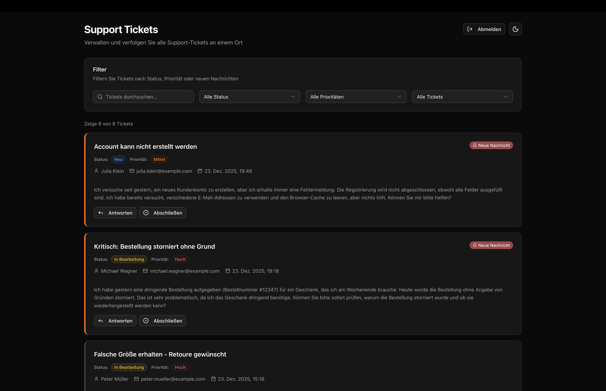

# Support Agent



## Funktionen

- 🎫 **Ticket-Verwaltung** - Support-Tickets erstellen, anzeigen und verwalten
- 💬 **Echtzeit-Messaging** - Direkt mit Kunden über die Plattform kommunizieren
- 🔍 **Erweiterte Filterung** - Tickets nach Status, Priorität und neuen Nachrichten filtern
- 📧 **E-Mail-Integration** - Automatische E-Mail-Benachrichtigungen für Ticket-Antworten
- 🔐 **Authentifizierung** - Sicheres Anmeldesystem für Support-Agenten
- 🌓 **Dunkler Modus** - Schöne dunkle und helle Themes
- 📱 **Responsives Design** - Funktioniert nahtlos auf allen Geräten

## Tools

- **Framework:** Next.js 16
- **Datenbank:** Supabase (PostgreSQL)
- **KI-Agent:** n8n
- **E-Mail:** Plunk
- **Hosting:** Vercel
- **Entwicklung:** Cursor

## Erste Schritte

### Voraussetzungen

- Node.js 18+ 

### Installation

1. Repository klonen:
```bash
git clone <repository-url>
cd support-agent
```

2. Abhängigkeiten installieren:
```bash
npm install
```

3. Umgebungsvariablen einrichten:
Erstellen Sie eine `.env.local` Datei im Hauptverzeichnis:
```env
NEXT_PUBLIC_APP_URL=http://localhost:3000
NEXT_PUBLIC_N8N_WEBHOOK_URL=
NEXT_PUBLIC_SUPABASE_URL=
NEXT_PUBLIC_SUPABASE_PUBLISHABLE_DEFAULT_KEY=
PLUNK_API_KEY=
```

4. Datenbank einrichten:
Führen Sie das SQL-Skript in `setup.sql` in Ihrem Supabase SQL-Editor aus, um die erforderlichen Tabellen und Richtlinien zu erstellen.

5. Entwicklungsserver starten:
```bash
npm run dev
```

6. Öffnen Sie [http://localhost:3000](http://localhost:3000) in Ihrem Browser.


